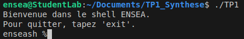
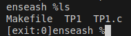
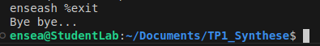
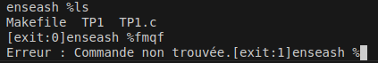

# TP de synthèse : création d'un Shell ENSEA
## Par Laurine BONNIN

  - Question 1 :

Nous sommes habitués à utiliser la fonction printf à chaque fois que l'on souhaite afficher un argument. La question 1 m'a permis de bien comprendre comment la fonction write s'utilisait. 
J'ai également réalisé que l'interface utilisateur dans un shell était importante en réalisant notamment l'affichage du prompt ou du message d'accueil.
J'ai compris dans quel cas l'utilisation de "const" était absolument nécessaire. En effet, "const" permet de déclarer un pointeur ou une variable comme étant constante afin que ce dernier ne soit jamais modifié. Ici je l'utilise pour les messages affichés dans le shell. 

 - Question 2 :

Lorsque j'ai utilisé read() pour lire une commande, je n'avais pas pensé au fait que le retour à la ligne est inclus dans la chaîne de caractères, ce qui pourrait entraîner des erreurs lors de l'exécution de la commande. J'ai donc utilisé strcspn() pour trouver la position du retour à la ligne et le remplacer par un caractère nul. Ce problème m'a permis de réaliser l'importance de vérifier les commandes entrées par l'utilisateur.

 - Question 3 :

J'ai appris ici à comparer deux chaines de caractères (celle entrée par l'utilisateur et 'exit') en utilisant la fonction strncmp. Cela m'a permis de comprendre comment cette fonction s'utilisait.

 - Question 4 :

Jusqu'à cette question je n'avais que très peu écrit de code dans le precessus père. Cette question m'a permis de bien comprendre qu'il était nécessaire que le code de cette question se situe dans le processus père. En effet, j'ai compris que lorsque l'utilisateur écrivait une commande, cette dernière devait être exécutée dans le processus fils. Le prcessus père lui attend que la commande soit réalisée avant de recevoir le statut de sortie du fils, c'est à dire si la commande a été exécutée avec succès ou non. Ensuite le père déterminera à partir de ce statut dans quel cas nous nous trouvons en affichant :
- [exit:0] si la commande s'est exécutée avec succès
- [exit:1] si il y a eu une erreur lors de l'exécution de la commande
- [sign:n] lorsque la commande a été interrompue par un signal (comme en utilisant la fonction sigkill) où n est le numéro du signal
